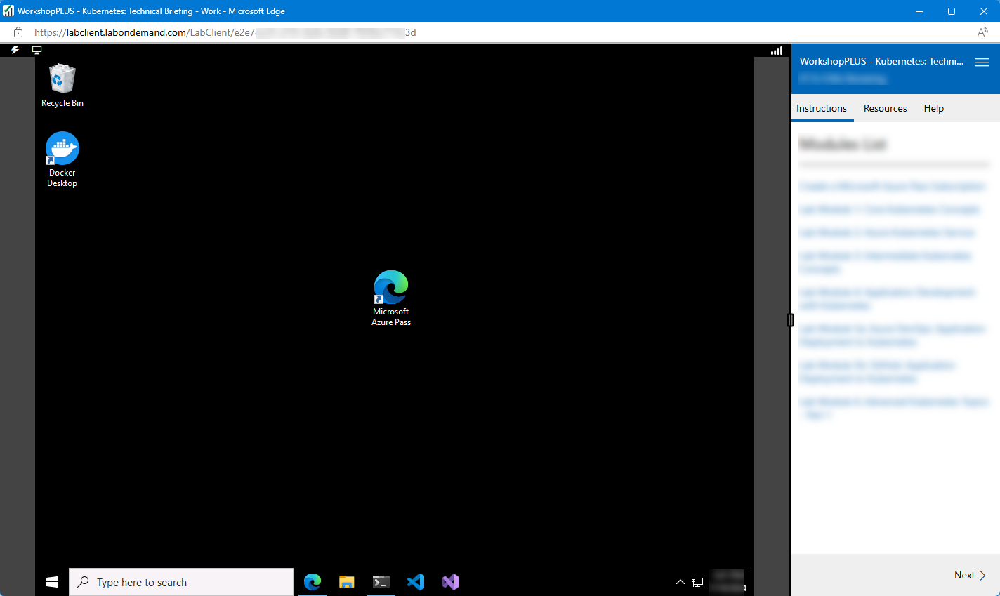
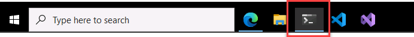
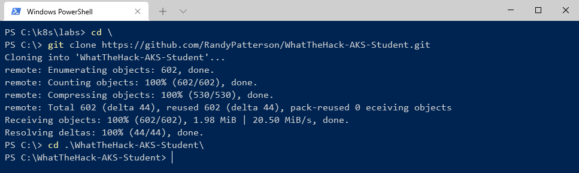

# Challenge 00 - Prerequisites - Ready, Set, GO!

**[Home](../README.md)** - [Next Challenge >](./Challenge-01.md)

## Introduction

Thank you for participating in the Intro To Kubernetes What The Hack. Before you can hack, you will need to set up some prerequisites.

A smart cloud solution architect always has the right tools in their toolbox.

## Description

First, Launch your Lab environment using the instructions provided by the coaches. When your Lab VM has started it should look similar to this:




### Student Resources
Download Git repository containing the student resources for this workshop.

1. Launch the Windows PowerShell terminal by clikcing on the icon in the bottom left of the screen.


in the PowerShell Terminal type the following commands
```PowerShell
cd \
git clone https://github.com/RandyPatterson/WhatTheHack-AKS-Student.git
cd .\WhatTheHack-AKS-Student\
```


## Success Criteria

1. You have a bash shell at your disposal (WSL, Mac, Linux or Azure Cloud Shell)
1. Running `az --version` shows the version of your Azure CLI
1. Visual Studio Code is installed.

From Here you can move on to the next challenge, [Challenge 1A](./Challenge-01A.md)